JAVAEE大型实验实验报告

校园活动管理系统

**2018-2019(1）**

项目名称 高校活动管理系统

组长姓名：程静

小组其他成员姓名：陈里杰、童思陶、徐伟峰、黄杨

指导教师：韩姗姗

所在学院：计算机科学与技术学院

提交日期：2021-1-4

目录

[第1章 绪论](#绪论)

[1.1 项目背景](#项目背景)

[1.2 项目基本情况](#项目基本情况)

[1.3 同类产品的分析和比较](#同类产品的分析和比较)

[1.4 项目的应用价值和社会效应](#项目的应用价值和社会效应)

[第2章 需求分析](#需求分析)

[3.1 可行性分析](#可行性分析)

[2.2 系统需求](#_Toc62412379)

[2.3 顶层系统用例](#23-顶层系统用例)

[2.6分角色的需求分析](#26分角色的需求分析)

[3 系统设计](#系统设计)

[3.1数据库设计](#31数据库设计)

[3.1.1 activity](#311-activity)

[3.1.2 activity_info](#312-activity_info)

[3.1.3 auditor](#313-auditor)

[3.1.4 college](#314-college)

[3.1.5 comment](#315-comment)

[3.1.6 organization](#316-organization)

[3.1.7 participation](#317-participation)

[3.1.8 position](#318-position)

[3.1.9 status](#319-status)

[3.1.10 user](#3110-user)

[3.2 数据流图](#32-数据流图)

[3.2.1顶层数据流图](#321顶层数据流图)

[3.2.2报名活动数据流图](#322报名活动数据流图)

[3.2.3活动管理数据流图](#323活动管理数据流图)

[3.2.4用户管理数据流图](#324用户管理数据流图)

[3.2.5签到签退数据流图](#325签到签退数据流图)

[3.2 决定计算机化什么部分,及如何去做](#_Toc62412400)

[3.3 给数据流图加入细节](#33-给数据流图加入细节)

[4 面向对象的设计说明书](#4-面向对象的设计说明书)

[4.1系统分解](#41系统分解)

[4.2活动管理子系统设计](#42活动管理子系统设计)

[4.3用户管理子系统设计](#43用户管理子系统设计)

[4.4活动签到子系统设计](#44活动签到子系统设计)

[4.5活动评价子系统设计](#45活动评价子系统设计)

[4.6数据管理子系统设计](#46数据管理子系统设计)

[5 测试技术说明书](#5-测试技术说明书)

[5.1管理员模块](#51管理员模块)

[5.1.1管理员登陆测试](#511管理员登陆测试)

[5.1.2管理员通过活动测试](#512管理员通过活动测试)

[5.1.3 管理员对活动信息进行管理](#513-管理员对活动信息进行管理)

[5.2普通用户模块](#52普通用户模块)

[6 系统实现](#6-系统实现)

[6.1普通用户系统实现](#61普通用户系统实现)

[6.2管理员系统实现](#62管理员系统实现)

[6.3功能测试](#63功能测试)

[7 实验总结](#7-实验总结)

[7.1 童思陶](#71-童思陶)

[7.2 徐伟峰](#72-徐伟峰)

[7.3 程静](#73-程静)

[7.4 陈里杰](#74-陈里杰)

[7.5 黄杨](#75-黄杨)

[附录](#_Toc62412425)

# 绪论

## 项目背景

如今，很多大学讲第二课堂列入了毕业的必须组成部分，这是因为大学早已不仅仅是第一课堂（即平日的讲座，实验环节），更多的体验和学习过程，需要学生依据自己的兴趣去探索发现。

校园第二课堂活动一直是大学生课外生活的重要组成部分。对于学生而言，自己感兴趣，有动力参与的活动，如果没有一个便捷，公开的平台，那就很容易错失。更多的学生没有精力去一个个筛选不同地理位置，不同时间举行的第二课堂活动，更难以和自己的课堂学习相调和。对于学校而言，一个审核各个活动的平台也是必要的，通过分析活动举办的地点和主题，更容易把控学生的动态，避免可能的风险，便于管理。

第二课堂活动是针对第一课堂的教学活动而言，它与第一课堂相配合，以育人为宗旨，以培训学生的基本技能和提高学生的综合素质为重点，以丰富的资源和空间为载体来展开的系列开放性活动，是另一个课堂，它与第一课堂共同构成完整的教育整体。目前开展了思想教育活动、文体竞赛和表演活动、科技学术活动、技能培训活动、咨询服务活动勤工助学活动和社会实践活动等类型的第二课堂活动。实践表明：健康有序的第二课堂活动对参与活动的主体---学生来说，起着非常重要的教育作用，非强制性的规范作用和多维度的感染作用。它不仅能有效预防学生越轨行为的发生，促成学生管理质量的提高，构建学生思想教育的活载体，增强学生思想教育的说服力和实效性，而且能点滴渗透，潜移默化地促进学生良好个性品质和人格素质的形成，培养学生的主体意识，强化学生的角色意识，养成学生的主体意识，强化学生的角色意识，养成学生的人文精神和科学精神，促成学生综合素质的全面提高，为第一课堂活动的深化生成一个特殊文化场。也就是说，第二课堂活动对于和第一课堂并非可有可无，它是以活动形态的文化张力来消解第一课堂面临的障碍，为第一课堂的深化拓展提供动力保障，反之，第一课堂的全面提升又为第二课堂延展了活动时间和空间，增强了活动的技术基础，使第二课堂活动获得了发展的条件。

## 项目基本情况

我们的项目已经基本具备了基础的所有功能。包括学生报名参与，签到签退。活动举办者申报活动，举办活动的功能。还有审核者审批活动，保卫处检验活动资质的功能。结合我们独到的基于地理位置的推荐系统，学生很难由于信息不足，错失了自己本来可以获得的学分。

除此之外，系统与学生校园生活的方方面面深度融合，破除了传统活动申报系统，第二课堂积分软件的僵硬死板，杂乱无章的特点。能够根据使用者报名活动的习惯进行智能推荐。同时，可以基于使用者的地理位置，实时推荐距离相近的活动，减少了可能的时间浪费，提高了参加活动的效率。除此之外，管理员可以看到活动的实时热力图，以及一段时间之内的时间统计，可以生成相关分析，进行具体可操作的调整建议。

我们希望我们的软件能够做到以下几点：

1.  活动目标的导向性。第二课堂活动的各项具体活动定位清晰，活动目标明确，即在活动的文化交流中接受文化塑造、达成素养的提升。
2.  活动内容的广泛性。第二课堂活动的内容常由活动的组织者同参与者以活动目标为指针，结合学生的发展需要，根据现有的活动资源和空间条件共同商定，在活动前甚至活动中均可以作适当调整。
3.  组织机制的灵活性。由于第二课堂活动的参与者具有共同的兴趣、爱好、特长及相应的发展水平，成员的文化价值判断标准同一。
4.  专业界限的模糊性。第二课堂活动不规定参与者的专业资格，只接纳具有某种活动爱好或具特定素质的大学生参加，可以打破班级和系科界线。
5.  活动时空的开放性。第二课堂活动由于组织机制的灵活性，活动方式的自主性，活动环境的广域性而表现为活动时空的开放性，打破了以班级为单位。它可不受既定的时间表按部就班地进行的限制，即活动时间可长可短。不仅可以走出课堂、也可走出校门、走向社会。
6.  活动效益的综合性。第二课堂活动本身所内涵的基本特性使活动的参加者在活动文化场中接受着文化塑造，特别是通过隐含于活动中的深层文化的长期熏染，可以在潜移默化中逐步培养学生的文化底蕴。

    我们系统的模块包括：

    活动模块

    参与活动模块（用户）

    举办活动模块（社团）

    审批活动模块（审计处）

    管理活动模块

    活动反馈模块

    公告模块

    管理第二课堂学分（辅导员--管理某个专业+年纪）

    按学期查询

    统计活动偏好

    管理社团积分（社团联合会）

    社团代表大会出席次数

    查看社团的积分顺序

    查看社团的学年活跃程度

    管理场地模块（场地管理员--社团）

    查看当前活动场地

    统计活动场地信息

## 同类产品的分析和比较

我们的系统的创新不仅仅体现在技术上。事实上，这是一种对大学现有的隐形资源的再次发掘。真正限制大学生发掘自己资源的，不是课业压力和繁忙的作息，而是由于信息发布不到位导致的信息不对称。

市面上的不少系统，是学校自己开发的，整个搜索功能都不完善，只收录了很少一些信息以供查询。另外的外包解决方案，可能只能单纯地通过学院，时间进行筛选，筛选掉了很多本来很有价值的活动。这些外包的解决方案，审批过程和报名过程分离，信息交互的接口不顺畅。

附表进行同类产品的比较

表格 1 同类产品比较

|          | 智慧校园活动系统(ours) | 外包服务app（如pu口袋) | 高校自主开发方式 |
|----------|------------------------|------------------------|------------------|
| 活动报名 | ✔                      | ✔                      | ✔                |
| 学分核算 | ✔                      | ✔                      |                  |
| 活动审核 | ✔                      | ✔                      |                  |
| 智能推荐 | ✔                      |                        |                  |
| 过审认证 | ✔                      |                        |                  |
| 路线规划 | ✔                      |                        |                  |

## 项目的应用价值和社会效应

**结果展示**

在通用数据上帮助高校管理第二课堂的同时，差异化展示各校学生的综合素质情况。

我们的系统可实现与其他系统的互联互通，可实现基本信息同步维护，数据便捷查询；我们的系统产生的活动、部落、学分等数据也可同步至学校，便于学校对大数据进行挖掘分析。

**精准数据运算**

我们的系统提供符合学校要求的定制数据结果，展现第二课堂教育成果，为学校提供更好的第二课堂教育以及学生素质教育指导。

**第二课堂数据分析**

我们的系统提供第二课堂数据多维度多条件的统计和分析，将各项结果准确图形化展示，并支持导出数据报告，便于学校对第二课堂大数据进行挖掘分析，对第二课堂的工作进行回顾和改进。

-   **社会效益**

实施智慧校园第二课堂活动系统行动计划离不开推进信息惠民和智慧校园建设，要充分利用现代信息技术，创新校园管理模式，实现对校园全地域覆盖、全时空监控、全过程综合管理，推进信息惠民和智慧校园建设，加快新一代信息技术在试点校园的创新应用和推广，推进校园综合服务体系建设，便民利民惠民，促进校园低碳化、绿色化、智能化发展。例如，一个重要的领域就是要大力发展智慧校园第二课堂活动系统全民学习保障，推动国家层面卫生信息平台之间的互联互通和信息共享，形成中国社会保障信息公共服务体系。推动人口学习信息平台之间的互联互通和信息共享，深化基于居民电子学习档案数据库、电子病历数据库、全员人口个案数据库的人口学习信息化智慧校园第二课堂活动系统行动计划的实施背景、内涵及主要内容工程，推进学习信息在家庭教师和学生之间共享利用。建设综合管理领域的业务应用系统，应用大数据、云计算、物联网等技术，建立开放、统一、优质、高效的“学习云”。引导卫生保健领域发展远程医疗服务，探索建设网络医院，推进智慧医疗应用；发展智能学习医学装备，开展居家养老、疾病看护、个性化学习管理等学习管理信息服务；加快学习信息安全产品研发，拓展学习信息服务新业态建设。建设群众体育信息服务平台，鼓励社会力量参与学生学习和群众体育服务，探索学生学习服务新模式。促进优质教育资源的共享利用，通过实施智慧校园第二课堂活动系统行动计划，深入推进智慧校园第二课堂活动系统教育，促进优质教育资源的共享利用。推动智慧校园第二课堂活动系统教育试点建设，发挥信息技术对教育现代化的支撑作用，建立教师备课、学生学习、教育管理决策等支撑系统，改善提升学校现有的信息化软硬件环境和应用水平，创新教学手段和模式，加快智慧校园建设。开发整合各类教育资源，建设大规模智慧学习平台，打造城乡一体化教育资源公共服务共享体系，为居民提供在线学习、终身学习等个性化学习服务。鼓励企业和社会机构挖掘需求，建设网络服务平台，面向不同人群提供开放式在线课程，丰富互联网产品。

# 需求分析

## 可行性分析

经济可行性

当前高校对于社团的投入总体来看，处于扩大趋势[1]，一方面，由于社团的对外交际，学校的品牌有了进一步的扩充，另一方面，由于学校重视社团发展，以及为了培育学生自由发展兴趣爱好的能力，选择更多地下放社团开办活动，使用学校场地，在学生宿舍宣传的手续。另一方面，学校对于社团的经费把控愈加严苛，这代表对于社团的精细化管理不断施行。

技术可行性

本平台采用B/S架构，方便客户的浏览、使用。

**对于后端**

我们根据J2EE三层结构，分为表现层、业务逻辑层和数据服务层，该分层结构，提高了软件的后期可维护性。三层结构以Spring+SpringMVC+Mybatis为支持，确保网站平台的高效、稳定、安全。

Spring是Java EE编程领域的一个轻量级开源框架，该框架由一个叫Rod Johnson的程序员在 2002 年最早提出并随后创建，是为了解决企业级编程开发中的复杂性，实现敏捷开发的应用型框架 。Spring解决了开发者在J2EE开发中遇到的许多常见的问题，提供了功能强大IOC、AOP及Web MVC等功能。Spring可以单独应用于构筑应用程序，也可以和Struts、Webwork、Tapestry等众多Web框架组合使用，并且可以与 Swing等桌面应用程序AP组合。因此， Spring不仅仅能应用于JEE应用程序之中，也可以应用于桌面应用程序以及小应用程序之中。

Spring MVC属于SpringFrameWork的后续产品，已经融合在Spring Web Flow里面。Spring 框架提供了构建 Web 应用程序的全功能 MVC 模块。使用 Spring 可插入的 MVC 架构，从而在使用Spring进行WEB开发时，可以选择使用Spring的Spring MVC框架或集成其他MVC开发框架

MyBatis 是一款优秀的持久层框架，它支持自定义 SQL、存储过程以及高级映射。MyBatis 免除了几乎所有的 JDBC 代码以及设置参数和获取结果集的工作。MyBatis 可以通过简单的 XML 或注解来配置和映射原始类型、接口和 Java POJO（Plain Old Java Objects，普通老式 Java 对象）为数据库中的记录。

Java是一种可以撰写跨平台应用程序的面向对象的程序设计语言。Java 技术具有卓越的通用性、高效性、平台移植性和安全性，广泛应用于PC、数据中心、游戏控制台、科学超级计算机、移动电话和互联网，同时拥有全球最大的开发者专业社群。

与传统程序不同，Sun 公司在推出 Java 之际就将其作为一种开放的技术。全球数以万计的 Java 开发公司被要求所设计的 Java软件必须相互兼容。“Java 语言靠群体的力量而非公司的力量”是Sun公司的口号之一，并获得了广大软件开发商的认同。这与微软公司所倡导的注重精英和封闭式的模式完全不同。

Sun 公司对 Java 编程语言的解释是：Java 编程语言是个简单、面向对象、分布式、解释性、健壮、安全与系统无关、可移植、高性能、多线程和静态的语言。

**对于前端**

React 使创建交互式 UI 变得轻而易举。为你应用的每一个状态设计简洁的视图，当数据改变时 React 能有效地更新并正确地渲染组件。以声明式编写 UI，可以让你的代码更加可靠，且方便调试。创建拥有各自状态的组件，再由这些组件构成更加复杂的 UI。组件逻辑使用 JavaScript 编写而非模版，因此你可以轻松地在应用中传递数据，并使得状态与 DOM 分离。无论你现在正在使用什么技术栈，你都可以随时引入 React 来开发新特性，而不需要重写现有代码。React 还可以使用 Node 进行服务器渲染，或使用 React Native 开发原生移动应用。

**对于数据库**

MySQL是一种开放源代码的关系型数据库管理系统（RDBMS），使用最常用的数据库管理语言--结构化查询语言（SQL）进行数据库管理。 MySQL是开放源代码的，因此任何人都可以在General Public License的许可下下载并根据个性化的需要对其进行修改。

SSM框架是当前业界使用最多，被证实现存成熟度最高的后端框架。而react是一个相对较新的响应式框架。Mysql则是业界使用最多的开源数据库之一。我们实现了前后端分离，可以轻而易举地进行开发和调试。

**社会可行性**

传统的大学教育十分重视第一课堂教学，其出发点是要培养学生精一门，这在较为封闭的时代有其合理性。但是，随着信息时代的到来，合作与竞争已成为时代的主流，因此，对合作的双方而言，如何合作不单是专业知识的问题，还涉及到人文素质、实践能力、协作能力、处理问题的能力、适应能力、组织管理能力、自控能力、敬业精神等，而这几者之间的平衡发展是第一课堂与第二课堂的密切配合的结果，在对毕业生就业的调查中显示，那些在学校积极参加各种活动各种协会或在团委、学生会、班级担任各种职务，社会活动能力强的同学，倍受用人单位欢迎，一次性就业率高，相反，一些在校考试成绩虽好，但性格内向，活动能力差的学生毕业后却在工作中均表现不能同程度的不适应，这是由于学校教育中第二课堂育人模式存在的不足带来的。目前，我国高校第二课堂育人模式存在的主要不足是第二课堂活动与教学工作距离太远，在其在丰富校园生活的同时更多地定位于是学生思想政治工作的重要载体。

**风险因素及对策**

本项目的智慧校园活动系统提供了识别和管理风险的流程，为举办参与双方建立透明的风险应对机制，明确风险发生后的解决方式并建立对后续工作的追踪，在风险管理活动中双方可随时对风险和应对方案进行评议，最大程度上确说动目的顺利实施。

**可行性分析结论**

本平台采用最新最稳定技术栈，受到社会和学校方面的支持，是绝对可行的。

## 系统需求

表格 2 术语表

| 举办者           | 举办活动的用户                                                                           |
|------------------|------------------------------------------------------------------------------------------|
| 审核者           | 负责审核的管理员                                                                         |
| 安保人员         | 维护场地，定时检查某场地举办活动的人员                                                   |
| 检验活动         | 用手机扫描活动二维码，会出现活动相关信息                                                 |
| 社团联合会       | 社团联合会是统计社团活动参与度的组织，可以查询某学生的活动参与或某社团的活动举办统计数据 |
| 辅导员           | 负责指导学生的工作人员，通过系统可以查询学生第二课堂学分                                 |
| 社团评优         | 社团一年内举办活动频率和参与率是评优的指标之一                                           |
| 统计第二课堂学分 | 第二课堂学分是决定学生是否能够毕业的重要依据，活动参与度可以算作第二学分                 |
| 注册活动         | 举办者提交活动相关信息以供审核                                                           |
| 审核             | 核实相关信息过后给活动进行批示，决定后续是否公开                                         |
| 通过             | 审核者通过活动，参与者可以报名活动                                                       |
| 打回             | 审核者未通过活动，举办者需要重新修改活动相关信息                                         |
| 锁定             | 审核者锁定该活动，举办者不能再重复提交相同活动                                           |
| 活动报名         | 通过检索将自己的姓名加入报名表中，是签到的前置条件                                       |
| 签到             | 扫描二维码录入个人信息，是签退的前置条件                                                 |
| 签退             | 填报个人信息，是获得学分以及评价的前置条件                                               |
| 评价活动         | 对活动进行打分，发表意见，回复他人评论                                                   |

## 2.3 顶层系统用例

通过前面几种需求获取方法获得对系统的初步理解后，我们建立一个小型自行车租赁系统的主要业务模型。可简单概述为：举办者通过系统建立活动实例，审核者审核其创建的活动，通过之后发布，参与者搜索到活动，加入活动，在活动开始时签到，结束时签退。管理员可查看学分。

我们通过UML用例图来建立业务模型。用例图为软件和软件使用者之间的交互建立模型，它体现了软件和软件运行环境之间的交互。用例图为开发者和客户提供了一个沟通的桥梁。没有计算机专业知识的客户通过用例图能够直观了解开发的软件是否符合自己的要求，而开发者可以通过用例图明确所开发的软件需求。用例描述是对用例图的一个解释，用文字来表述图像无法表达的内容，包括用例对应的操作步骤、用例触发的前置条件、后置条件等。在用例描述中，前置条件表示在用例启动之前必须符合的条件。后置条件描述用例结束时的系统状态或持久数据。基本路径表示顺利执行的一系列操作，扩展路径表示异常时所做的操作。在顶层用例中，我们仅需要对需求进行简要描述，然后在后续求精过程中逐步细化。如图1-4是系统顶层用例图及用例描述。

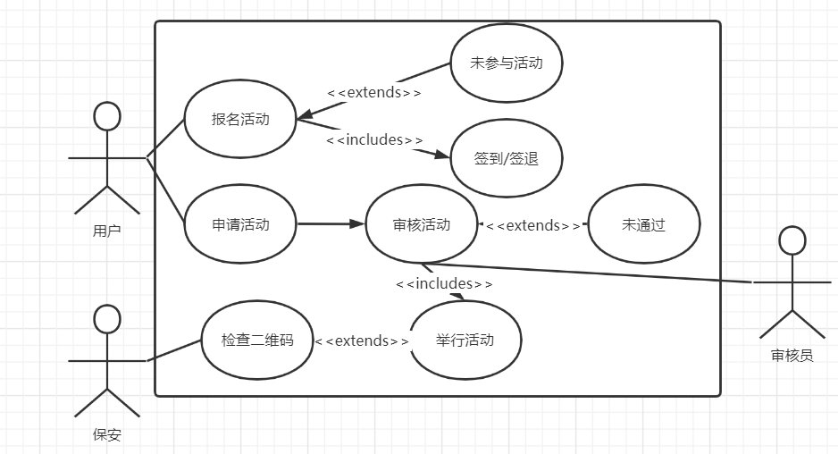

图表 1 顶层用例图

租借管理用例描述如表2-1所示。

表 2-1 注册活动用例描述

| 用例名称 | 注册活动                         |
|----------|----------------------------------|
| 用例描述 | 提交活动基本信息，用于管理员审查 |
| 参与者   | 举办者                           |

表 2-2 报名活动用例描述

| 用例名称 | 报名活动                             |
|----------|--------------------------------------|
| 用例描述 | 选择活动基本信息，然后提交到系统当中 |
| 参与者   | 参与者                               |

表 2-3 签到/签退用例描述

| 用例名称 | 签到/签退活动                                      |
|----------|----------------------------------------------------|
| 用例描述 | 参与活动之前扫描二维码完成签到，然后提交到系统当中 |
| 参与者   | 参与者                                             |

表 2-4 审核用例描述

| 用例名称 | 审核活动                                   |
|----------|--------------------------------------------|
| 用例描述 | 查看所有待审核的活动，选择其中一个通过与否 |
| 参与者   | 审核者                                     |

表 2-5 检查二维码描述

| 用例名称 | 检查二维码                             |
|----------|----------------------------------------|
| 用例描述 | 保安扫描活动的二维码，确证活动通过审批 |
| 参与者   | 保安                                   |

##### 3.5 审核用例迭代

需求获取是一个迭代的过程，随着需求获取工作的深入展开，应逐步细化用例。

提交活动的主要步骤：举办者将活动的详细信息填表，上交给审核员。审核员确认相关信息，决定是否通过。如果不通过，可以选择锁定当前活动或者打回给举办者更改相关信息。

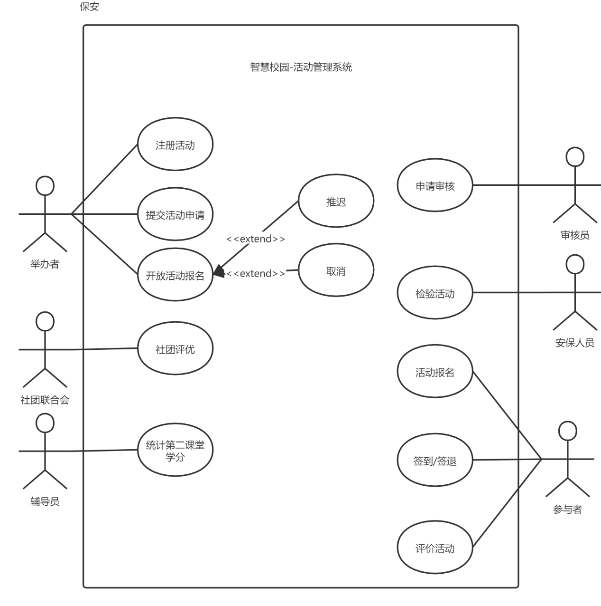

图表 2 迭代用例图

表 2-5注册活动用例描述

| 用例名称 | 注册活动                                                                                                                                                                                             |
|----------|------------------------------------------------------------------------------------------------------------------------------------------------------------------------------------------------------|
| 用例描述 | 举办者活动                                                                                                                                                                                           |
| 参与者   | 举办者                                                                                                                                                                                               |
| 前置条件 | 举办者登录并提供活动相关信息                                                                                                                                                                         |
| 后置条件 | 通过/打回                                                                                                                                                                                            |
| 基本路径 | 1.举办者进入申请活动页面 (1)填报符合要求的信息 (2)确认过后上传至系统当中 (3)等待审核结果  1)如果选择通过，则系统将活动移除列表  2)如果选择不通过，则系统将活动移除列表，并通知举办者 (4)活动审理完毕 |
| 扩展路径 | 1. 举办者取消活动 (1)选择活动相关信息：取消 (2)点击确认，活动相关信息被清除 (3)参与者动取消的信息                                                                                                    |

2-6开放活动报名

| 用例名称 | 开放活动报名                                                                                                                         |
|----------|--------------------------------------------------------------------------------------------------------------------------------------|
| 用例描述 | 举办者开放活动报名                                                                                                                   |
| 参与者   | 举办者                                                                                                                               |
| 前置条件 | 审核者通过举办者提交申请的活动                                                                                                       |
| 基本路径 | 1.举办者获得通过结果                                                                                                                 |
| 扩展路径 | 1. 举办者取消活动 2. 举办者推迟活动 (1)举办者选择推迟活动按钮 (2)举办者重新选择活动日期，不能提前 (3举办者点击确认，重新计算开始日期 |

表 2-7审核活动用例描述

| 用例名称 | 审核活动                                                                                                                                                                                                                |
|----------|-------------------------------------------------------------------------------------------------------------------------------------------------------------------------------------------------------------------------|
| 用例描述 | 审核员审核互动                                                                                                                                                                                                          |
| 参与者   | 审核员                                                                                                                                                                                                                  |
| 前置条件 | 审核员已登录                                                                                                                                                                                                            |
| 后置条件 | 通过/打回                                                                                                                                                                                                               |
| 基本路径 | 1.审核员通过待审核列表批阅 (1)审核员在待审核列表中进行审理 (2)系统将活动详细信息显示 (3)审核员选择通过/打回  1)如果选择通过，则系统将活动移除列表  2)如果选择不通过，则系统将活动移除列表，并通知举办者 (4)活动审理完毕 |
| 扩展路径 | 禁止相同活动再次提交                                                                                                                                                                                                    |

表 2-8检验活动用例描述

| 用例名称 | 检验活动                                                              |
|----------|-----------------------------------------------------------------------|
| 用例描述 | 安保人员检验活动                                                      |
| 参与者   | 安保人员                                                              |
| 前置条件 | 活动已经开始                                                          |
| 后置条件 | 有网络通信                                                            |
| 基本路径 | 1.安保人员打开收集扫描二维码 2. 安保人员对照二维码信息，检查是否合规  |
| 扩展路径 | 1. 二维码信息与当前状况不符 2. 终止违规活动                           |

表 2-9报名活动用例描述

| 用例名称 | 报名活动                                                                                                                                        |
|----------|-------------------------------------------------------------------------------------------------------------------------------------------------|
| 用例描述 | 参与者报名活动                                                                                                                                  |
| 参与者   | 参与者                                                                                                                                          |
| 前置条件 | 活动已经开放报名                                                                                                                                |
| 基本路径 | 1. 按照地理位置查找活动 2. 地图选点，进入相应活动主页 3. 查看活动详细信息，报名人数，活动时间状态等等 4. 点击报名按钮 5. 点击确认按钮，确认报名 |
| 扩展路径 | 1. 报名人数已满，无法报名 2. 活动在查看时取消，无法报名                                                                                         |

表 2-10签到用例描述

| 用例名称 | 签到                                                                                                                              |
|----------|-----------------------------------------------------------------------------------------------------------------------------------|
| 用例描述 | 参与者签到                                                                                                                        |
| 参与者   | 参与者                                                                                                                            |
| 前置条件 | 活动开始前后15分钟内                                                                                                              |
| 基本路径 | 1. 用手机扫描活动二维码，进入填报个人信息主页 2. 填写个人相关信息表单 3. 点击提交，提交个人信息 4. 点击确认，确认提交 5. 签到成功 |
| 扩展路径 | 1. 未签到，此活动不计入学分                                                                                                       |

表 2-11签退用例描述

| 用例名称 | 签退                                                                            |
|----------|---------------------------------------------------------------------------------|
| 用例描述 | 参与者签退                                                                      |
| 参与者   | 参与者                                                                          |
| 前置条件 | 活动距结束15分钟内 已签到                                                       |
| 基本路径 | 1. 在手机上填报个人信息 2. 点击提交，上传系统 3. 点击确认，确认提交 4. 签退成功 |
| 扩展路径 | 1. 未签退，此活动不计入学分                                                     |

表 212评价活动用例描述

| 用例名称 | 评价活动                                                        |
|----------|-----------------------------------------------------------------|
| 用例描述 | 参与者评价活动                                                  |
| 参与者   | 参与者                                                          |
| 前置条件 | 完成签退 活动结束                                               |
| 后置条件 | 内容合规                                                        |
| 基本路径 | 1. 点击评价按钮 2. 点击星星打分 3. 输入对活动的评价 4. 评价成功 |
| 扩展路径 | 1. 点击回复按钮 2. 增加回复头 3. 输入对活动的回复 4. 回复成功   |

表 213社团评优用例描述

| 用例名称 | 社团评优                                                                                                   |
|----------|------------------------------------------------------------------------------------------------------------|
| 用例描述 | 社团联合会社团评优                                                                                         |
| 参与者   | 社团联合会                                                                                                 |
| 前置条件 | 参评社团举办活动结束                                                                                       |
| 后置条件 | 活动没有取消或被举报                                                                                       |
| 基本路径 | 1. 点击排序按钮 2. 按照公式：point = n\*k%计算分数，其中n是参与总人数，k是签到率，按降序排列。 3. 评价成功 |

表 2-14计算第二课堂学分用例描述

| 用例名称 | 计算第二课堂学分                                                                 |
|----------|----------------------------------------------------------------------------------|
| 用例描述 | 辅导员计算第二课堂学分                                                           |
| 参与者   | 辅导员                                                                           |
| 前置条件 | 学期结束                                                                         |
| 后置条件 | 没有短学期                                                                       |
| 基本路径 | 1. 选择其管辖需要计算第二课堂的学分 2. 计算其第二课堂学分 与培养计划要求学分比较 |
| 拓展路径 | 1. 学分不足 (1) 向学生发送警告信息                                               |

## 2.6分角色的需求分析

1)举办者

举办者是活动系统当中的主要对象，举办者可以填报活动申请表单，上传完成活动申请，还可以更改活动限制人数，推迟活动日期等等。

举办者发布的活动是整个系统的开端，有了举办者发布的活动，审核人员才能够对活动的具体内容进行审核。举办者需要提供活动的基本信息，如，活动地点，限制参与人数，活动图片，活动举办学院等等信息。这些信息一方面有助于管理员审核学生的基本信息，另一方面，能够帮助参与者进一步定位活动并选择适合自己的活动。

举办者同普通用户一样，拥有自己的的个人用户信息，可以进行注册、登录、修改密码等操作。

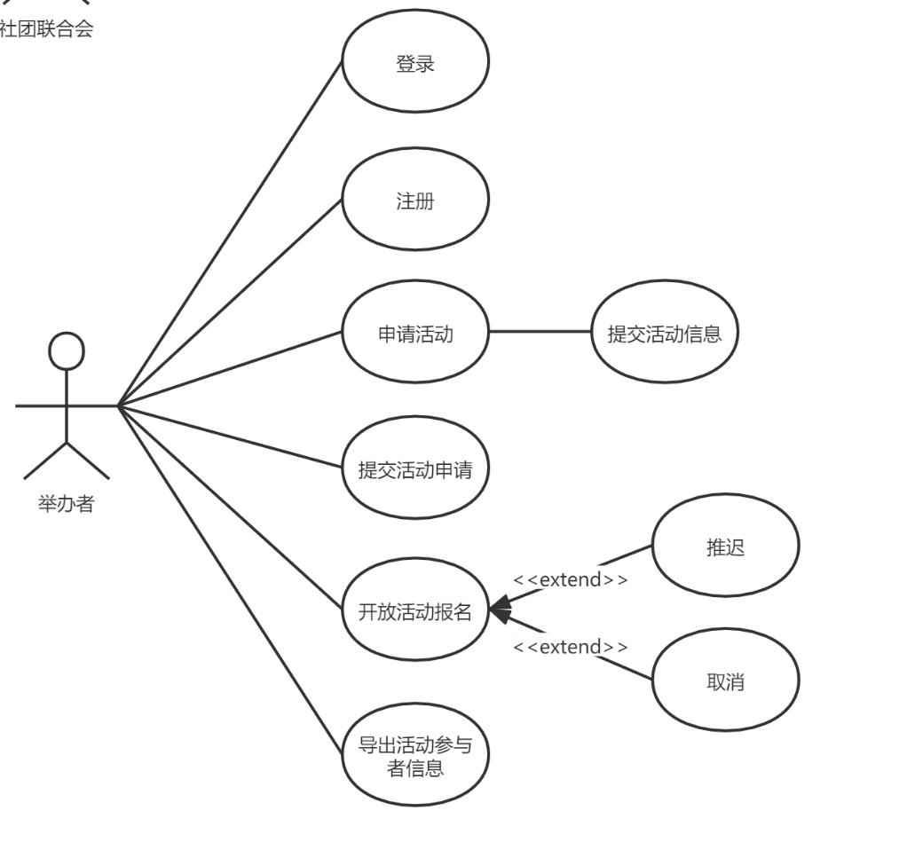

图表 3 举办者用例图

2)参与者

参与者是我们系统的主要角色之一。参与者是参与活动的人，他可以进行注册登录，并且可以对活动进行报名，然后选择活动的具体内容。他涉及了我们系统的特色功能：包括地图选点，签到签退，以及评价活动。我们的目标就是要创建一个用户友好的系统，尽可能地减少搜索的损失，让参加活动的过程更加顺畅。

参与者都是普通用户，有登录注册等功能，还能够查看已经报名的地图上的地点，以及活动的时间线。

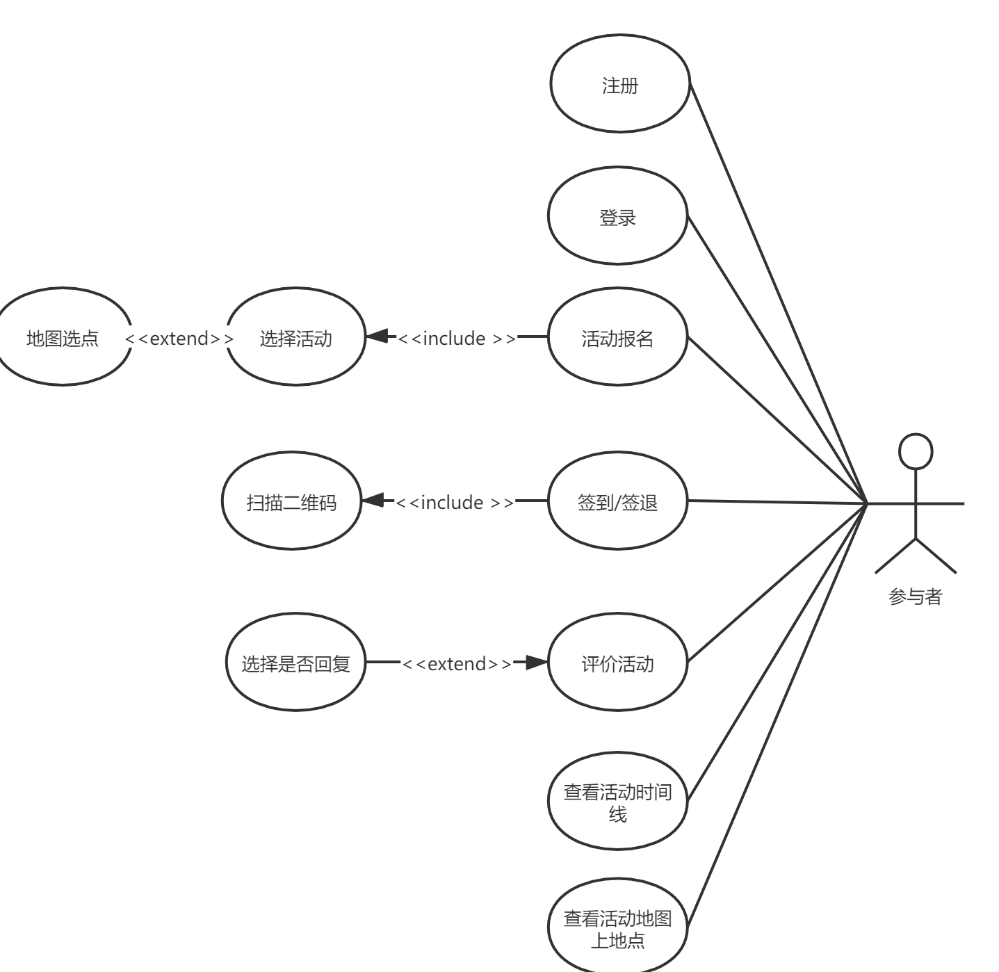

图表 4 参与者用例图

3)审核员

审核员也叫审核者，负责的内容是对申请的活动进行审核，决定活动是否能够通过，并将结果发回给举办者，如果结果是通过，那么活动就能够被报名了。

审核员兼任了管理者的角色，能够查看活动的统计数据。其登录和注册都是和普通用户分开的。

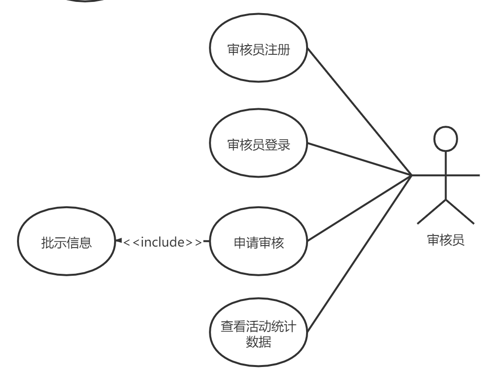

图表 5 审核员用例图

4) 安保人员

安保人员能够扫描二维码，并且检验活动的内容。主要涉及的到的系统部分就是活动二维码，如果发现活动举办者真正举办的活动和报告的活动内容不符，安保人员有权利保障在场人员的安全并中止或上报违规活动。

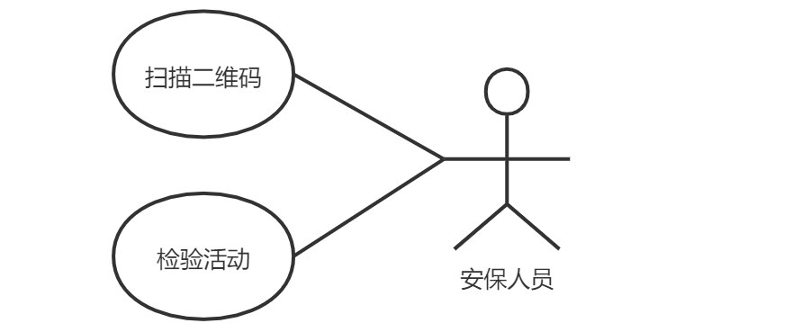

图表 6 安保人员用例图

# 系统设计

## 3.1数据库设计

### 3.1.1 activity

| 字段        | 说明               | 类型         |
|-------------|--------------------|--------------|
| id          | 活动编号，自动增长 | int          |
| name        | 活动名称           | varchar(255) |
| college_id  | 学院编号           | int          |
| position_id | 活动地点           | int          |
| start_time  | 开始时间           | datetime     |
| end_time    | 结束时间           | datetime     |
| director_id | 审核人编号         | int          |
| status_id   | 状态编号           | int          |

### 3.1.2 activity_info

| 字段              | 说明                   | 类型         |
|-------------------|------------------------|--------------|
| id                | 活动信息编号，自动增长 | int          |
| activity_id       | 活动编号               | int          |
| people_limit      | 限制人数               | int          |
| people_registered | 注册人数               | int          |
| people_enrolled   | 签到人数               | int          |
| people_quitted    | 签退人数               | int          |
| activity_img      | 活动图片               | varchar(255) |
| activity_intro    | 活动简介               | text         |

### 3.1.3 auditor

| 字段       | 说明           | 类型         |
|------------|----------------|--------------|
| id         | 编号，自动增长 | int          |
| auditor_id | 审核人编号     | int          |
| name       | 审核人姓名     | varchar(255) |
| role       | 审核人角色     | varchar(255) |

### 3.1.4 college

| 字段        | 说明           | 类型         |
|-------------|----------------|--------------|
| id          | 编号，自动增长 | int          |
| name        | 学院名称       | varchar(255) |
| description | 学院描述       | varchar(255) |

### 3.1.5 comment

| 字段        | 说明           | 类型         |
|-------------|----------------|--------------|
| id          | 编号，自动增长 | int          |
| user_id     | 用户编号       | int          |
| activity_id | 活动编号       | int          |
| rate        | 级别           | int          |
| description | 评论           | varchar(255) |

### 3.1.6 organization

| 字段            | 说明           | 类型         |
|-----------------|----------------|--------------|
| id              | 编号，自动增长 | int          |
| organization_id | 组织编号       | int          |
| college_id      | 学院编号       | int          |
| name            | 组织名称       | varchar(255) |
| description     | 描述信息       | varchar(255) |

### 3.1.7 participation

| 字段          | 说明           | 类型     |
|---------------|----------------|----------|
| id            | 编号，自动增长 | int      |
| staff_id      | 用户编号       | int      |
| activity_id   | 学院编号       | int      |
| register_time | 报名时间       | datetime |
| enroll_time   | 签到时间       | datetime |
| quit_time     | 签退时间       | datetime |

### 3.1.8 position

| 字段      | 说明           | 类型           |
|-----------|----------------|----------------|
| id        | 编号，自动增长 | int            |
| name      | 地点名称       | varchar(255)   |
| longitude | 经度           | decimal(15,10) |
| latitude  | 纬度           | decimal(15,10) |
| detail    | 详细信息       | varchar(255)   |

### 3.1.9 status

| 字段        | 说明           | 类型         |
|-------------|----------------|--------------|
| id          | 编号，自动增长 | int          |
| activity_id | 活动编号       | int          |
| auditor_id  | 审核人编号     | int          |
| apply_time  | 申请时间       | datetime     |
| deal_time   | 审核时间       | datetime     |
| result      | 结果           | varchar(255) |

### 3.1.10 user

| 字段       | 说明           | 类型         |
|------------|----------------|--------------|
| id         | 编号，自动增长 | int          |
| staff_id   | 用户编号       | int          |
| password   | 密码           | varchar(255) |
| name       | 姓名           | varchar(255) |
| role       | 角色           | int          |
| college_id | 学院编号       | int          |
| class      | 班级           | varchar(255) |
| phone      | 电话号码       | varchar(255) |

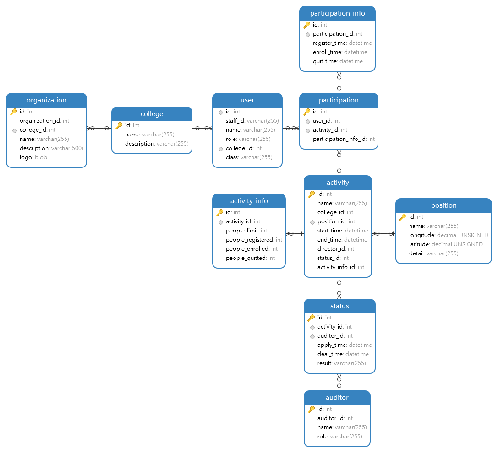

图表 7 E-R图

## 3.2 数据流图

### 3.2.1顶层数据流图

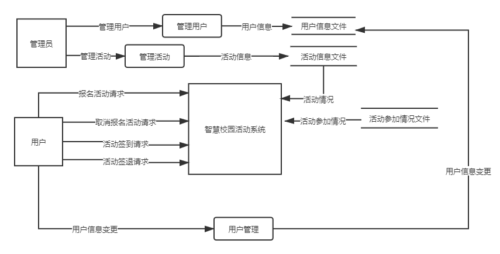

图3.2.1 顶层数据流图

### 3.2.2报名活动数据流图

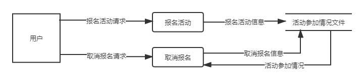

图3.2.2 报名活动数据流图

### 3.2.3活动管理数据流图

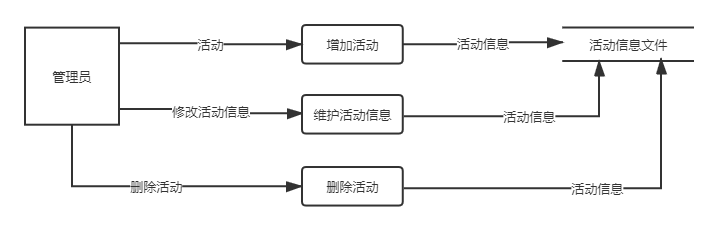

图3.2.3 活动管理数据流图

### 3.2.4用户管理数据流图

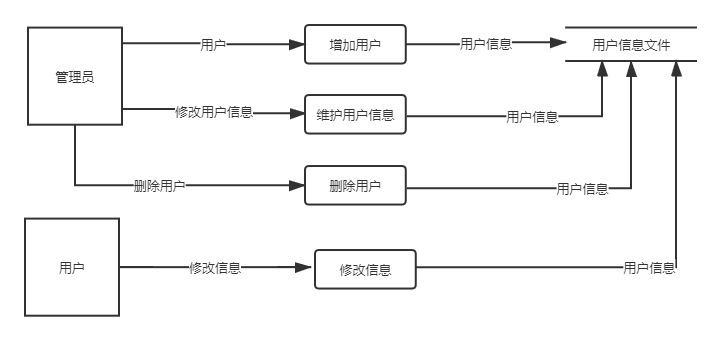

图3.2.4 用户管理数据流图

### 3.2.5签到签退数据流图

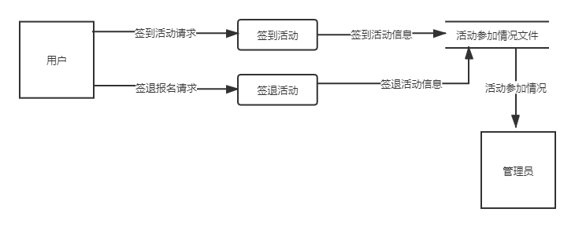

图3.2.4 签到签退数据流图

## 3.2 决定计算机化什么部分,及如何去做

1、系统涉及的数据库的操作（增加删除修改检索）

2、各项报表的打印

3、对用户参加活动的短信通知，Email通知

4、系统管理人员对系统的维护

## 3.3 给数据流图加入细节

# 4 面向对象的设计说明书

## 4.1系统分解

本系统计划设计成为网站供用户使用，团队在项目开发过程中采用SSM作为后端框架，使用html5+CSS+JavaScript 进行前端开发，技术路线的选择使我们选择使用 Spring boot开发项目。

Spring Boot是由Pivotal团队提供的全新框架，其设计目的是用来简化新Spring应用的初始搭建以及开发过程。该框架使用了特定的方式来进行配置，从而使开发人员不再需要定义样板化的配置。通过这种方式，Spring Boot致力于在蓬勃发展的快速应用开发领域(rapid application development)成为领导者。

## 4.2活动管理子系统设计

在活动管理子系统，最主要的是对活动信息的增加、删除、修改和查询。用户可以根据自己的需要，进行申请活动和报名活动。在申请创建一个活动时，需要填写活动的详细信息，并提交后台进行审核。用户可以根据自己的需要输入对应的关键字，获得自己的目标活动，并进行报名。在修改活动信息时，采用aop的方式对数据进行验证，保证数据的正确性和安全性。

## 4.3用户管理子系统设计

在使用本系统之前，需要先进行注册并登录。在用户注册时，我们加入的短信验证码的模块，一定程度上避免重复注册等情况的发生。

用户的身份包括普通用户和管理员身份。在登录时，需要输入学号或工号以及密码进行登录。

对于管理员身份的用户，可以进行修改普通用户的信息以及删除普通用户记录。

## 4.4活动签到子系统设计

用户报名活动以后，需要在活动规定的时间，到达指定地点，并向负责人出示相应的活动二维码。

## 4.5活动评价子系统设计

用户在参加完活动之后，可以对该活动进行评价，也可以查看别人的评价。

从而对该活动有更加全面的认识。

## 4.6数据管理子系统设计

我们设计的项目中获取和存储的数据多为结构化数据，整个项目的数据量较小，对存取性能的要求并不高，因此采用关系型数据库管理系统Mysql进行管理。

包含：每个用例的实现：用例类图、顺序图或协作图

# 5 测试技术说明书

## 5.1管理员模块

### 5.1.1管理员登陆测试

（1）输入正确的账号密码

预期结果：登录成功

（2）使用不存在的账号登录

预期结果：登录失败

（3）输入正确的账号和错误的密码

预期结果：登录失败

### 5.1.2管理员通过活动测试

（1）同意未通过的活动

预期结果：操作成功

（2）同意已通过的活动

预期结果：操作失败

### 5.1.3 管理员对活动信息进行管理

（1）修改的信息符合已有信息的逻辑

预期结果：操作成功

（2）修改的信息不符合已有信息的逻辑

预期结果：操作失败

（3）查看所有活动的信息

（4）查看已经通过的活动的信息

（5）查看未通过的活动的信息

（6）通过关键词查找相应的活动

## 5.2普通用户模块

5.2.1普通用户登录测试

（1）输入正确的账号密码

预期结果：登录成功

（2）使用不存在的账号登录

预期结果：登录失败

（3）输入正确的账号和错误的密码

预期结果：登录失败

5.2.2普通用户申请活动

（1）申请的活动的详细信息符合要求的格式

预期结果：添加申请成功

（2）申请的活动的详细信息不符合要求的格式

预期结果：添加申请成功

5.2.3普通用户报名活动

（1）报名已通过的活动

预期结果：报名成功

（2）报名的活动不符合要求

预期结果：报名失败

# 6 系统实现

## 6.1普通用户系统实现

本系统普通用户拥有的功能有：登录、注册、创建活动、报名审核已通过的活动、查看自己已报名的活动、查看自己创建的活动、修改自己的密码

1.  **登录功能**

①用户登录界面为[http://localhost:3000/dva-boot-admin\#/dva-boot-admin/sign/login](http://localhost:3000/dva-boot-admin#/dva-boot-admin/sign/login)，如图所示。

图6-1

②用户输入自己的学号和密码后，调用/activity/LoginUser中的loginUser（）方法验证自己身份信息，如图所示，进入系统完成登陆。

图6-2

关键代码：

③退出系统

点击“退出系统”，清除浏览器存储的store，跳转到登录页面。

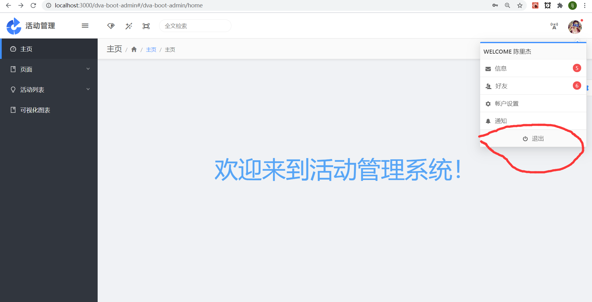

1.  **注册功能**
    1.  用户注册界面为[http://localhost:3000/dva-boot-admin\#/dva-boot-admin/sign/login](http://localhost:3000/dva-boot-admin#/dva-boot-admin/sign/login)，如图所示。

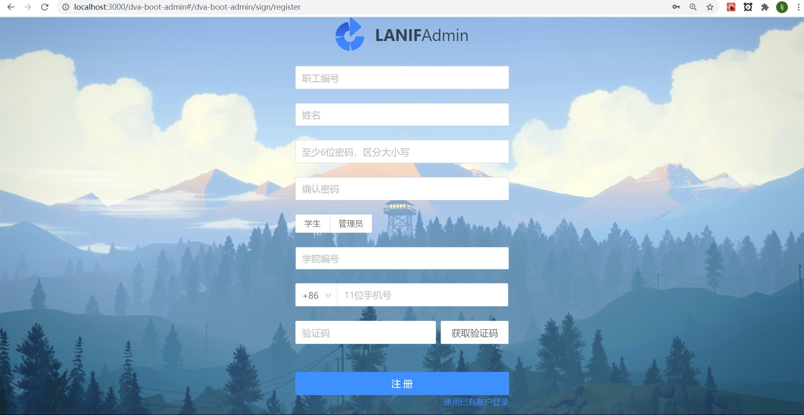

1.  用户在获取验证码时，会调用getAuthcode（）方法，获取验证码。当验证码输入错误时，如图所示。

    

    关键代码：

    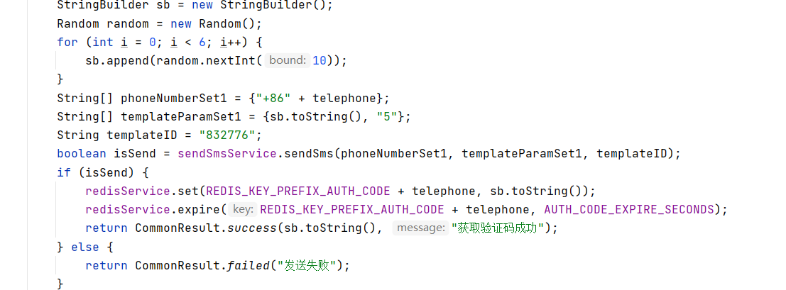

    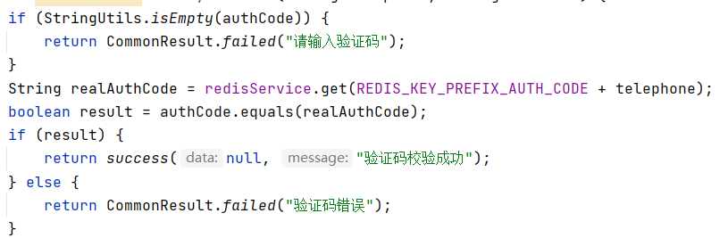

    1.  用户输入自己信息，调用/activity/createUser中的createUser（）方法。创建成功时，会跳转到注册成功页面

关键代码：

1.  **创建活动功能**
    1.  用户可在左侧导航处点击创建活动进入创建活动页面，如图所示。

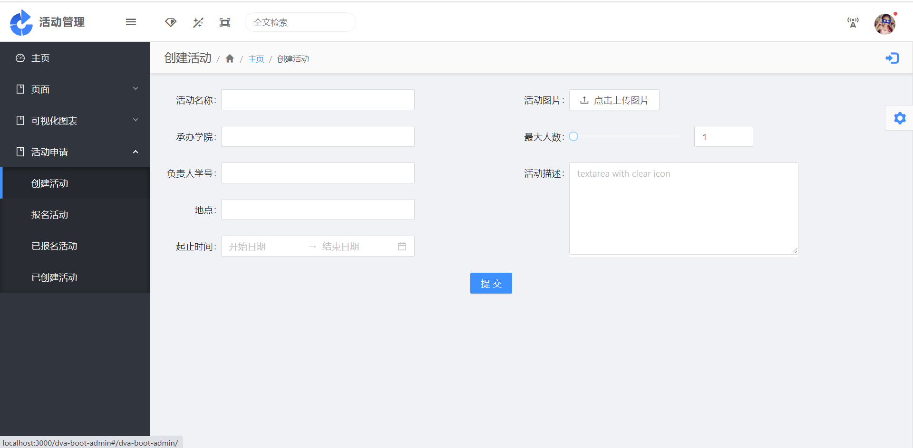

1.  用户可通过调用/minio/upload方法上传图片至服务器中，如下图所示。

可在后台查看上传的图片信息。

关键代码：

1.  用户通过百度Bmap提供的JavaScript库来查询地点信息，使得活动地点信息的录入准确无误。

1.  用户通过调用/activity/create中的createActivity（）方法创建出相应的活动信息，创建成功信息如图所示。

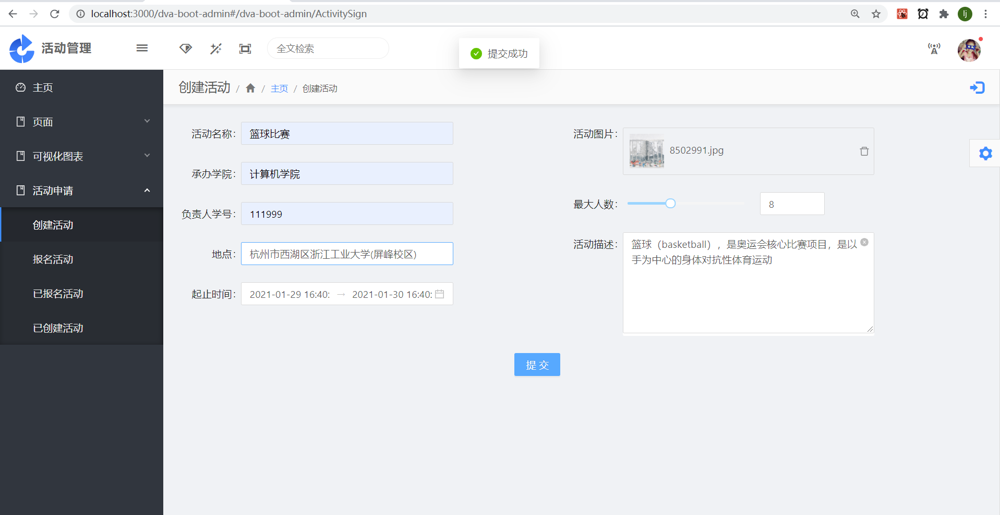

关键代码：

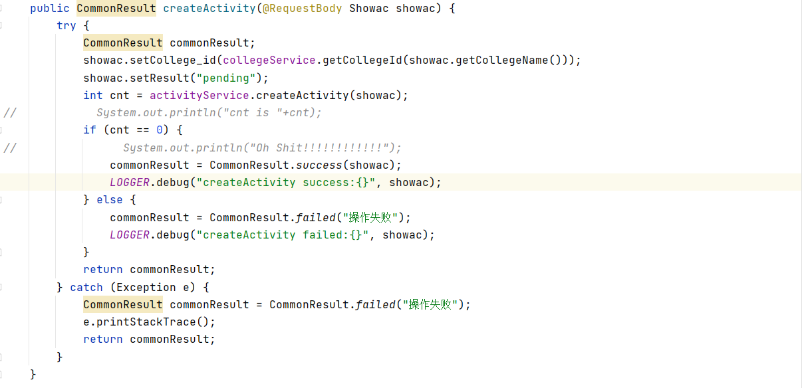

1.  **报名审核通过的活动**
    1.  用户可在左侧导航处点击报名活动进入报名活动页面，如图所示。

关键代码：

1.  用户可在操作栏点击链接可跳转至用户详情界面，如图所示。

关键代码：

1.  用户通过扫描二维码跳转到签到界面。需填写相应的学号和姓名信息完成该活动的签到，且满足签到时间在活动开始前后30分钟以及活动未过期。

关键代码：

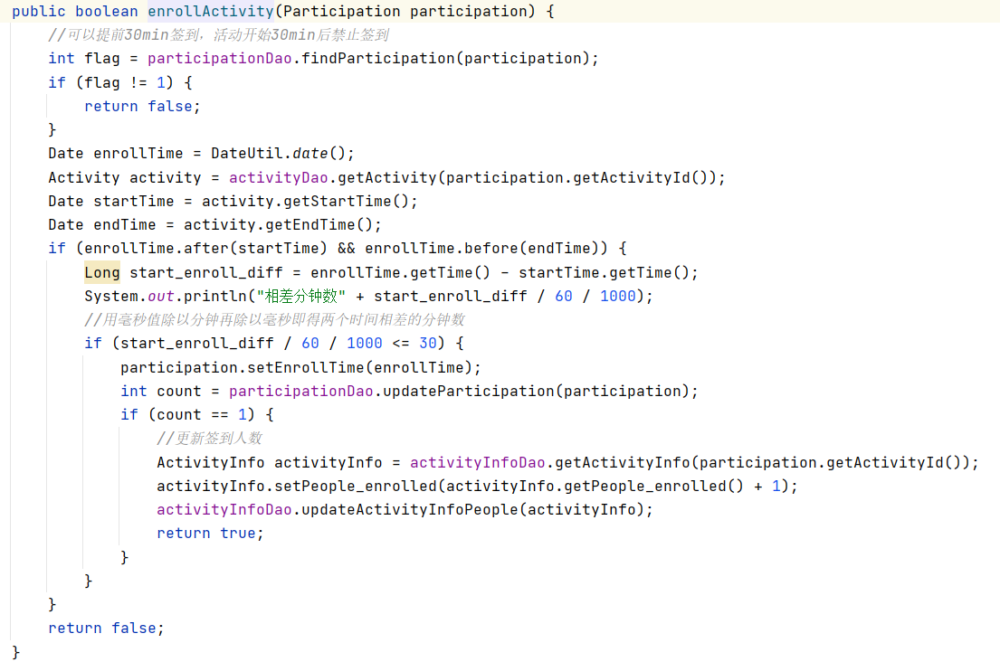

1.  用户可通过点击活动概述模块可查看当前活动的详细信息。

    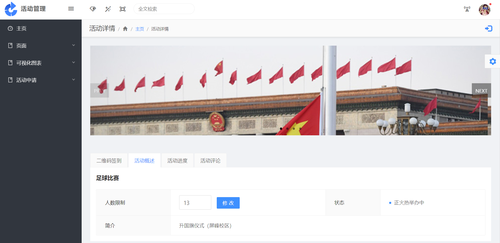

    1.  用户可通过点击活动进度模块可查看当前活动的实时信息。

1.  用户可通过点击活动评论模块可查看当前参与者对该活动的相关评论及相应打分。

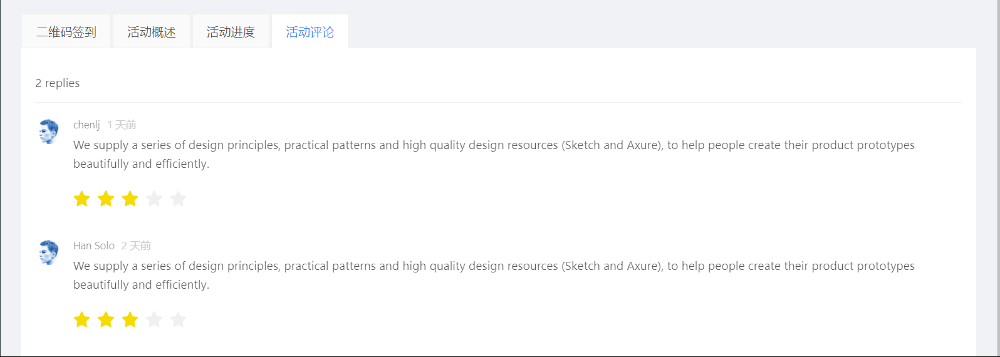

1.  用户可通过点击✔图标来报名自己感兴趣的活动，并进一步通过弹出的模块框确认。

    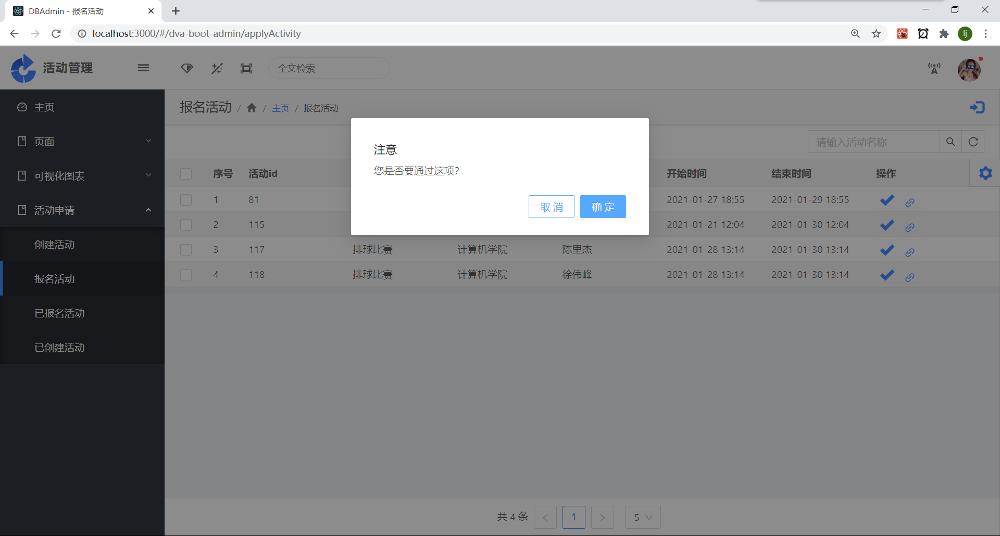

    关键代码：

    

    1.  用户可在右上角根据关键字模糊查询相应活动信息。通过调用/activity/askBykeywords中的askBykeywords（）方法返回对应活动信息。

关键代码：

1.  **查看已报名活动**
    1.  用户可在左侧导航处点击已报名活动进入已报名活动页面，如图所示。

        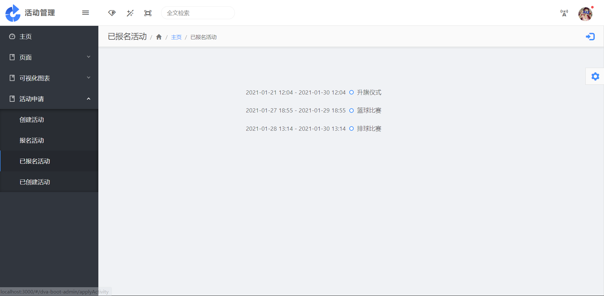

    2.  通过调用/activity/getUserActivity中的getUserActivity（）方法，传入用户学号，可获取用户已报名的相关活动。

        关键代码：

        

2.  **查看已创建的活动**
    1.  用户可在左侧导航处点击已创建活动进入已创建活动页面，如图所示。

        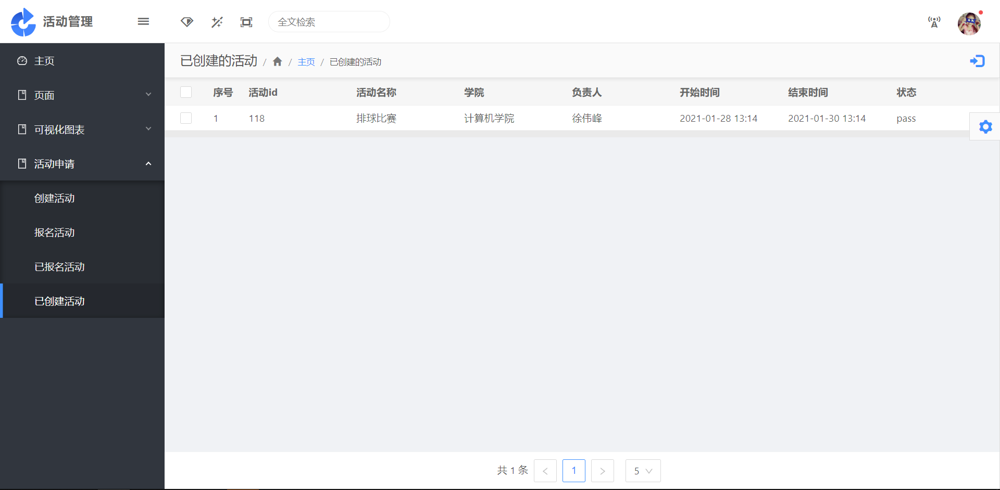

    2.  通过调用/activity/director中的geDirectorrActivity（）方法，传入用户学号，可获取用户已创建的相关活动。

        关键代码：

        

## 6.2管理员系统实现

管理员是系统中很重要的一个角色,我们这个系统需要在用户报名活动之初就要设立为这个用户设立一个管理员,这个管理员主要负责进行审核用户提交上来的活动，并予以通过、不通过的处理。同时管理员还能修改活动的相关信息，包括活动学院和负责人等。

1.  **管理员的登录入口和注册入口和普通用户一样。我们可以通过登录者的role字段来区分身份。数据库属性如下。**

    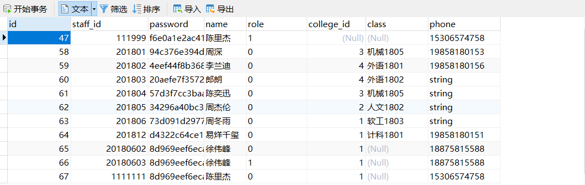

2.  **待审批活动**
    1.  管理员可通过点击左侧导航栏活动列表下的待审批活动查看自己将要审核的活动，从中调用/activity/listFailed中的listActivityFailed（）方法。如下图所示。

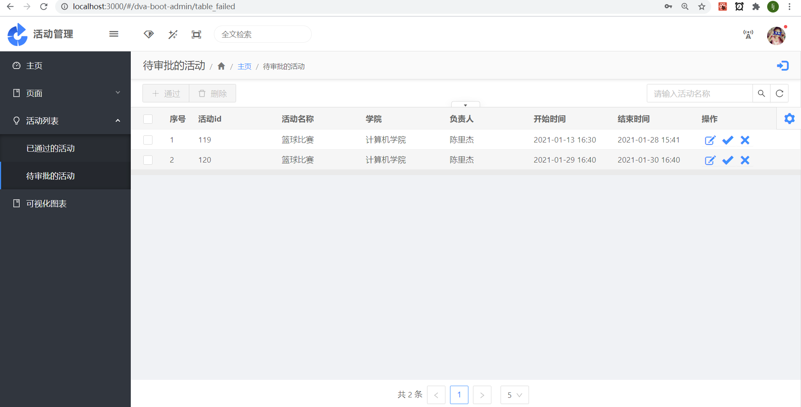

关键代码：

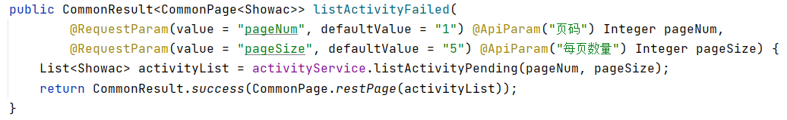

1.  管理员可点击修改按钮修改活动的相关信息。如下图所示。

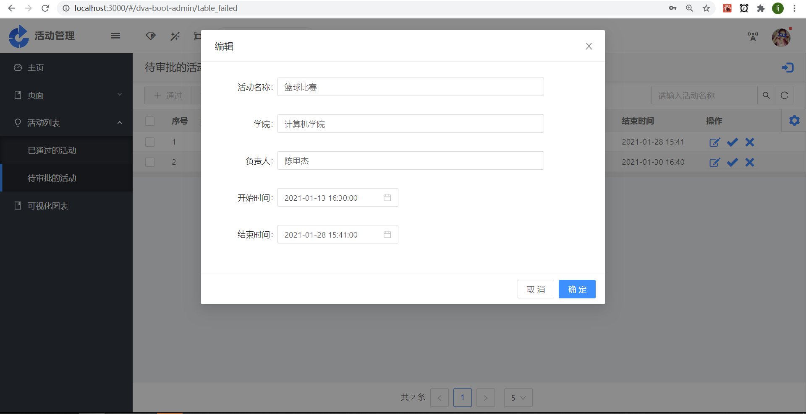

关键代码：

1.  管理员可点击通过按钮或不通过按钮选择是否通过该活动。如下图所示。

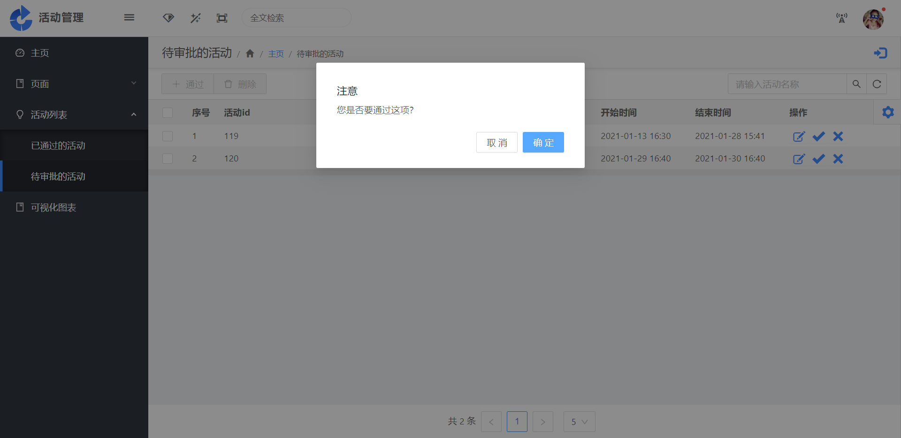

关键代码：

1.  **已通过活动**
    1.  管理员可通过点击左侧导航栏活动列表下的已通过活动查看自己已经通过的活动，从中调用/activity/listPassed中的listActivityPassed（）方法。如下图所示。

关键代码：

1.  管理员可点击修改按钮修改活动的相关信息。如下图所示。

关键代码：

1.  管理员可在操作栏点击链接可跳转至活动详情界面，如图所示。

关键代码：

## 6.3功能测试

1.  **测试用户或管理员登录时学号密码不能为空。**

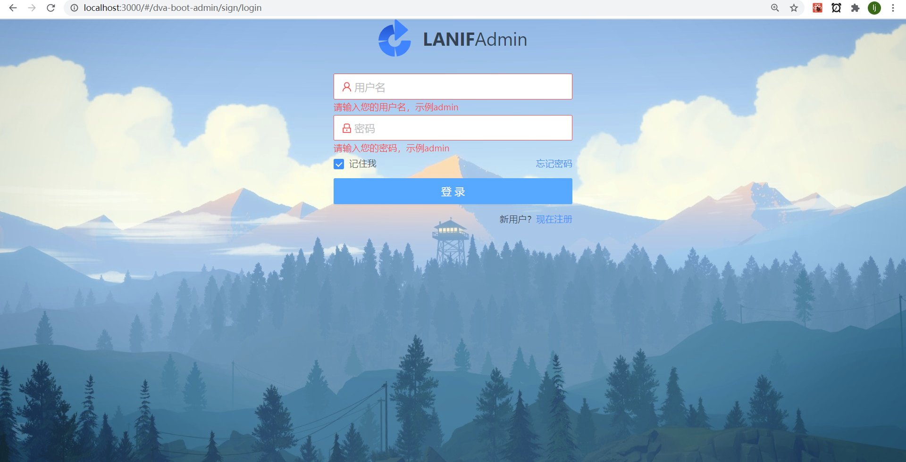

1.  **登陆成功页面。**

    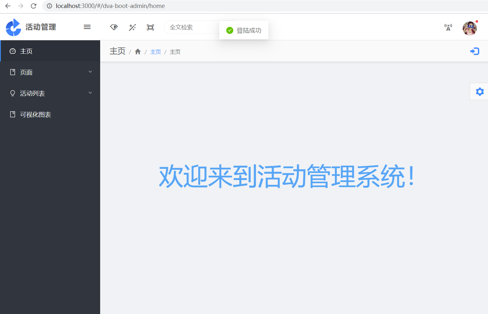

2.  **修改活动的承办学院。当要修改的学院在数据库的表项中时。将升旗仪式的学院修改为人文学院**

    

    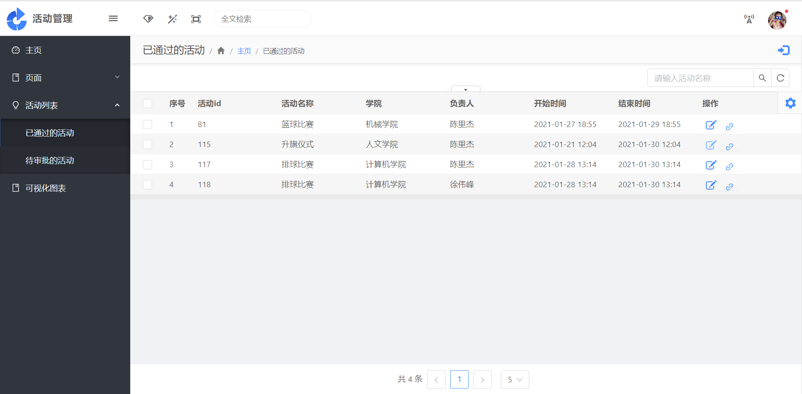

3.  **修改活动的承办学院。当要修改的学院不存在于数据库的表项中时。将篮球比赛的学院修改为艺术学院。**

    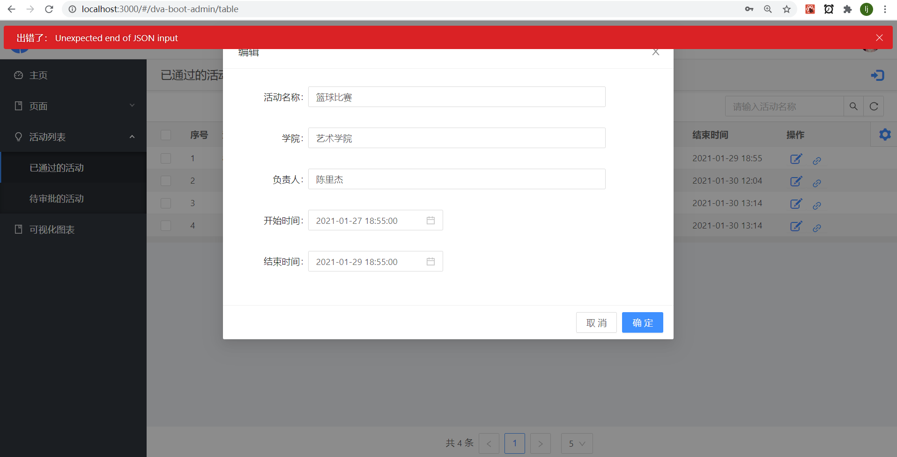

4.  **修改活动的负责人。当要修改的负责人在数据库的表项中时。将篮球比赛的负责人修改为徐伟峰。**

    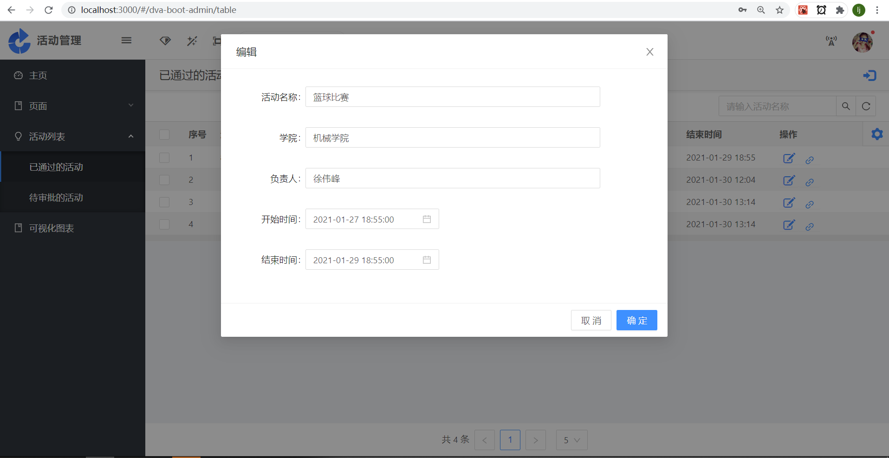

    

5.  **修改活动的负责人。当要修改的负责人不存在于数据库的表项中时。将篮球比赛的负责人修改为赵六。**

    

6.  **当用户注册，填写错误的验证码时。**

    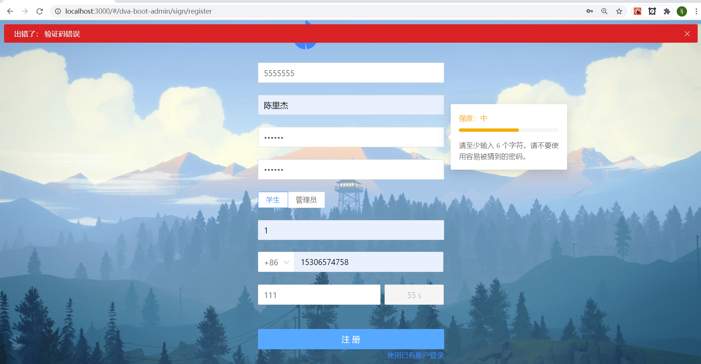

7.  **用户输入正确的验证码**

    

8.  **用户在填写注册信息的某几项为空时。**

    

9.  **当前时间不在活动签到的前后三十分钟内，而用户签到时。**

    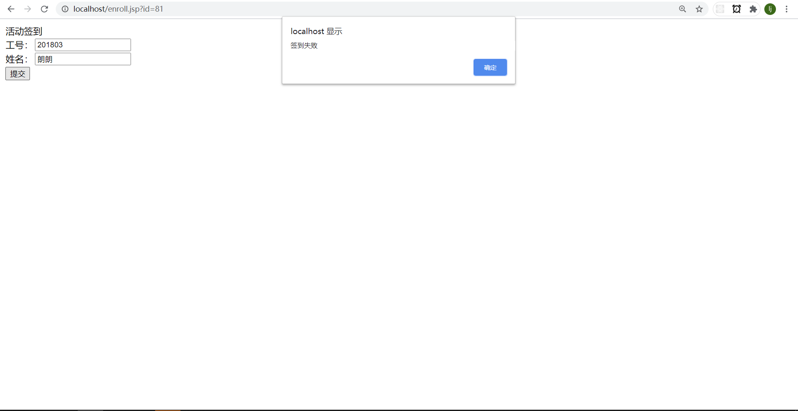

10. **该活动未过期且当前时间在活动开始的前后三十分钟内。**

    

11. **用户在关键字搜索时不输入任何数据，会展示活动所有内容**

    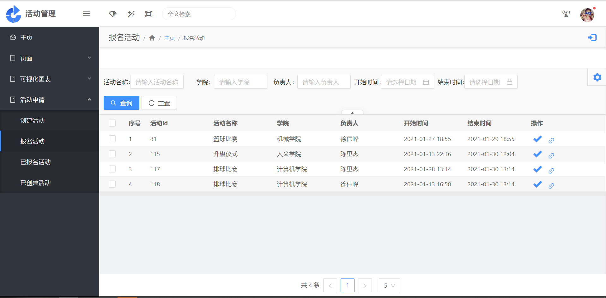

12. **用户在关键字搜索时检索错误信息，会显示暂无数据的信息**

    

# 7 实验总结

## 7.1 童思陶

**关于协作**

我们小组由5个人组成，相比之前一人成军的项目，采用框架搭建的项目要求小组中的每个人负责某个横向或者纵向的内容，例如，横向的，比如我做的数据库部分，陈里杰做的则是前端部分，而纵向则是我做的评论部分，徐伟峰做的关于用户的部分。则一切的组合需要有一个恒定的标准来协作，否则容易出现种种问题。尽管我们采用CVS来帮助我们避免可能的代码丢失，仍然出现了在git pull时丢失代码的事件（并且清理了stashed code，导致需要重做），不过比起不采用的损失，用git确实为我们的开发提高了效率。

**关于J2E开发技术**

我们采用的框架是目前时兴的SSM框架，很多大公司都采用ssm框架进行网站的框架。如今的前后端技术伴随着互联网企业的蓬勃发展，发展速度很快。前端现在已经弃用了JSP页面，转而使用vue.js等前端框架进行快速开发。由于陈里杰同学对react比较熟悉，于是就靠他来完成整个前端的开发。我们则需要对其发送json数据，他可以按需取用。

编写后端代码的时候，由于程静同学已经配置好了框架的基本配置。我们只需要更改核心部分的代码。关于数据库等相关的依赖注入都在spring的配置文件中写好了。其他的例如bean和映射等内容，我们只需要使用注解就能够轻松完成。有了基础的框架，开发起来就相当得心应手，此时的困难可能就集中于如何根据前端发来是数据进行查询，获取需要的数据库中的记录，再者就是如何采用安排controller，能够最大效用地满足前端的需要。同时，为了避免前端传输数据的错误或者直接收到封包的数据，后端也需要对某些操作进行校验，利用AOP可以对校验操作进行解耦，与主页面分离。同时，根据阿里巴巴开发手册，我在数据库当中没有增加任何的外键，所有的外键全部都搬运到了业务层。在删除某些被外键的记录时，需要级联删除或是置空，在具体的service当中都可以按照需求调用dao。spring框架的方式对于代码重用，对象维护，面向切面编程(AOP)的好处都是可感知的。

## 7.2 徐伟峰

通过这一次的JAVAEE项目，我体会到了大项目开发与平时的小项目的不同之处，这与以往个人单独开发项目完全不一样，整个小组按照完整的软件生命周期，对项目进行各个层面上的需求分析，不断修改迭代，最终项目汇集了各个成员的想法才得以完整的呈现，在这个过程中，我明白了整个项目的开发不仅仅是代码的实现部分，前期详细准确的调查分析和设计显得尤为重要，良好的需求分析，可以大大的简化后期的实现。同时，大型项目的开发，尤其需要开发人员之间的合作。在本次前后端分离地开发过程中，前后端地开发人员能够有效地沟通。但同时，也出现了因为代码命名规范等问题，导致系统出错而艰难地DEBUG的问题。开发人员在开发过程中，应当清楚地意识到当前开发的模块对于整个项目的作用，对于项目当前所处的阶段应当有清楚的认识。在具体实现方面，我们采用了SSM框架。由于是新学到的知识，我们还无法非常熟练地运用，在项目遇到具体问题时，大部分需要进行沟通才能解决，对于一些比较难以实现的模块，要改变策略，换一个方向实现可能会有更好的效果。这也使得我们对软件项目有了更加深刻地认识。  
在这次的项目开发以后，我对于Spring有了进一步的理解，Spring提供的面向切面变成的丰富的支持，允许通过分离应用的业务逻辑与系统级服务（例如审计（auditing）和事务（transaction）管理）进行内聚性的开发。应用对象只实现它们应该做的——完成业务逻辑——仅此而已。它们并不负责（甚至是意识）其它的系统级关注点，例如日志或事务支持。许多不容易用传统OOP实现的功能可以通过AOP轻松应付。我们在项目的开发过程中，采用了aop对用户的数据首先进行检验其是否符合数据的安全性，只有符合安全性，才能进行相应的修改。同时，采用aop的方式，大大的降低了项目的耦合程度。

## 7.3 程静

这次通过JavaEE大型实验收获颇丰：

1、老师上课讲的主要是SSH框架，但是想到平时做实验已经练习了很多，而直接使用SpringBoot的话跨度太大，所以最终我们选择了SSM框架。在这个过程中，提高了自学能力，也提高了解决问题的能力；

2、对开发和代码编写有了更进一步的认识，当做一个新的功能点时，需要学习需要不断改正错误，但好在学习到了很多。在代码编写过程中，SSM框架的搭建和配置文件的编写、通用返回对象的设计、java的时间处理、Mybatis的时间处理和mysql数据库的时间处理、HTTP的GET和POST、使用Restful API、Swagger的整合、OSS（对象存储Object Storage Service）使用Minio实现图片的存储、二维码生成、签到签退业务逻辑的实现、腾讯云短信服务发送短信验证码、Spring和Redis整合实现验证码存储失效，Spring定时任务向参加活动的用户发送短信提醒等等，以功能为驱动实现系统，一般都会遇到比较多的问题，通过上网查找、询问老师等方法，最终错误也能被改正，实现想要的目的和效果；

3、之前的课程设计都是个人孤军奋战做的，第一次和2-3人合作一起写代码，从组员身上学习到了很多，同时提高了与他人合作的能力，让我意识到自己还有很多不足，比如团队协作、代码能力、学习能力、认真态度。因此需要持续不断的学习，提升自身的能力。

## 7.4 陈里杰

本次javaEE课程设计我们这组做的课题是基于web的校园活动管理系统，我们 组将整个系统设计成基于SSM的校园活动管理系统，系统分为两个角色：用户、管理员。整个系统我们小组成员在组长的带领下实现了登录、注册、创建活动、报名审核已通过的活动、查看自己已报名的活动、查看自己创建的活动、修改自己的密码等一系列功能。

课程设计是培养学生综合运用 所学知识 ,发现,提出,分析和解决实际问题 ,锻炼实践能力的重要环节 ,是对学生实 际工作能力的具体训练和考察过程 .随着科学技术发展的日新日异， WEB开发已经成 为当今计算机应用中空前活跃的领域， 在生活中可以说得是无处不在。 因此作为 二十一世纪的大学来说掌握WEB开发的开发技术是十分重要的。 回顾起此次课程设计，至今我仍感慨颇多，的确，从选题到定稿，从理论到实践，在整整 两星期的日子里，可以说得是苦多于甜，但是可以学到很多很多的的东西

这次课程设计，使我灵活应用所学 javaEE 知识，和小组成员一起完成 问题分析，结合 javaEE 理论知识，编写程序实现系统所需功能。初步掌握软件 开发过程的问题分析、系统设计、程序编码、测试等基本方法和技能；提高综合 运用所学的理论知识和方法分析和解决问题的能力； 并用系统的的观点进行系统 设计，巩固、深化学生的理论知识，提高编程水平，并在此过程中培养我们严谨 的科学态度和良好的编程风格。在这一 次的实践过程中，不论是个人动手能力， 还是团队合作能力， 方方面面都得到了 一定程度的提高。通过这次课程设计使我明白了自己知识还比较欠缺， 只是 学习书本知识还是远远不够的， 自己不会的东西还有太多， 学习需要自己长期的 积累，在以后的学习、 工作中都应该不断的学习， 将课本的理论知识与生活中的 实践知识相结合，不断提高自己文化知识和实践能力。

## 7.5 黄杨

本次JavaEE课程设计我们小组的课题是智慧校园活动管理系统，基于SSM框架实现该系统。

通过这次的课程设计，使我灵活应用所学的JavaEE知识，结合JavaEE的理论知识，编写程序实现系统所需功能。在讨论过程中就软件开发过程中的问题分析、程序设计、程序编码、测试等方面展开讨论和分析，提高了在项目分析过程中的分析能力；提高综合运用所学的理论知识和方法分析和解决问题的能力；并用系统的观点进行系统设计，巩固并深化我的理论知识，提高编程水平，并在此过程中培养了我严谨的科学态度和良好的编程风格，进一步加深对SSM框架的知识的理解，并能够利用SSM框架的知识实现该活动管理系统。

同时在此次的课程设计中，我培养了以专业的眼光去对待系统中的每一段代码，这是一次不可多得的实践机会。在此次实践中，不论是个人动手能力还是团队合作能力，方方面面都得到了一定程度的提高。在这个过程中，我学会了许多学习的方法，而这也是最实用和宝贵的，在面对今后社会的挑战，只有不断学习、实践，再学习、实践，这对我的将来也有很大帮助。

并且在此次实验中，我更加深入地了解到了SSM等框架在企业级项目中的优势。mybatis通过将sql写在xml文件中，便于统一的管理和优化，解除了sql和程序代码的耦合，同时支持对象关系映射标签和对象关系的组建，并且支持编写动态sql；Spring的IOC特性和AOP特性，将对象的依赖关系交给了Spring的控制，方便解耦，简化了开发，也容易实现事务、日志、权限的控制；SpringMVC使用MVC设计思想的轻量级web框架，对web层进行解耦，拥有灵活的数据验证、格式化和数据绑定机制等特点。而在我们系统的开发过程中很好地实现了前后端分离，在此过程中能够对后端进行解耦验证，及时避免了错误的发生，以及有利于整个系统的搭建，也通过实践清晰认识到了SSM框架中相互联系和工作流程，这都是无法仅通过学习清晰认识的。

在系统设计过程中，与同学分工设计，和同学们相互探讨，相互学习，相互监督。此次课程设计是一次模拟的社会实践，是我们迈向社会，从事职业工作前一个必不少的过程。不仅是对这学期所学知识的一种综合检验，而且也是对自己动手能力的一种提高，增强了自己实践能力。总而言之，经历了此次的课程设计，最明显的还是感觉到自己知识的不足，对于一些东西还是缺乏一个系统的准确的理解。JavaEE是门很有用的课程，学习范围之外的东西还有很多很多，JSP让我接触到了全新的网页编程，也让我知道，学无止境，想要全面深入的掌握一门语言，还是要付出很大的努力的。
