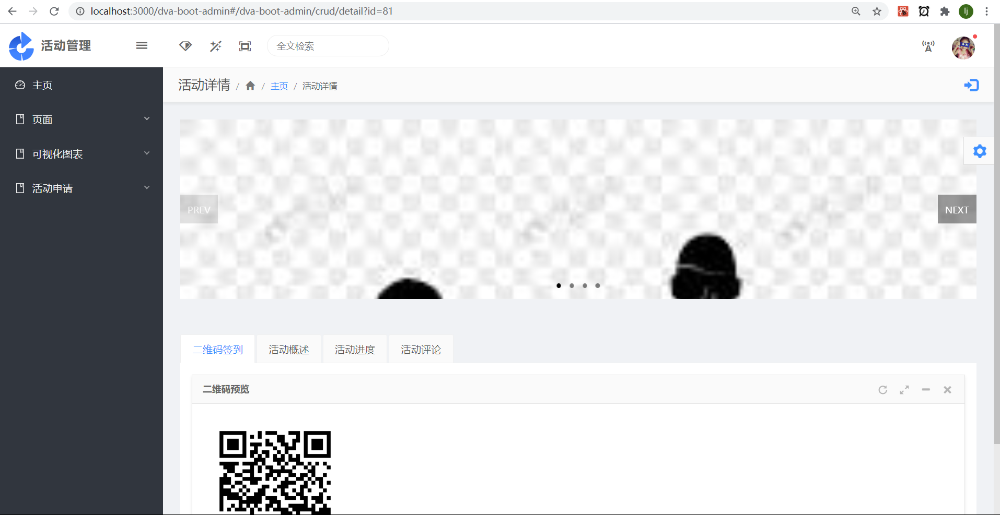

# campus_activity_stystem

我们的项目已经基本具备了基础的所有功能。包括学生报名参与，签到签退。活动举办者申报活动，举办活动的功能。还有审核者审批活动，保卫处检验活动资质的功能。结合我们独到的基于地理位置的推荐系统，学生很难由于信息不足，错失了自己本来可以获得的学分。

除此之外，系统与学生校园生活的方方面面深度融合，破除了传统活动申报系统，第二课堂积分软件的僵硬死板，杂乱无章的特点。能够根据使用者报名活动的习惯进行智能推荐。同时，可以基于使用者的地理位置，实时推荐距离相近的活动，减少了可能的时间浪费，提高了参加活动的效率。除此之外，管理员可以看到活动的实时热力图，以及一段时间之内的时间统计，可以生成相关分析，进行具体可操作的调整建议。

## 6.1普通用户系统实现

本系统普通用户拥有的功能有：登录、注册、创建活动、报名审核已通过的活动、查看自己已报名的活动、查看自己创建的活动、修改自己的密码

1.  **登录功能**

①用户登录界面为[http://localhost:3000/dva-boot-admin\#/dva-boot-admin/sign/login](http://localhost:3000/dva-boot-admin#/dva-boot-admin/sign/login)，如图所示。

图6-1

②用户输入自己的学号和密码后，调用/activity/LoginUser中的loginUser（）方法验证自己身份信息，如图所示，进入系统完成登陆。

图6-2

关键代码：

③退出系统

点击“退出系统”，清除浏览器存储的store，跳转到登录页面。

1.  **注册功能**
    1.  用户注册界面为[http://localhost:3000/dva-boot-admin\#/dva-boot-admin/sign/login](http://localhost:3000/dva-boot-admin#/dva-boot-admin/sign/login)，如图所示。

1.  用户在获取验证码时，会调用getAuthcode（）方法，获取验证码。当验证码输入错误时，如图所示。

    

    关键代码：

    

    

    1.  用户输入自己信息，调用/activity/createUser中的createUser（）方法。创建成功时，会跳转到注册成功页面

关键代码：

1.  **创建活动功能**
    1.  用户可在左侧导航处点击创建活动进入创建活动页面，如图所示。

1.  用户可通过调用/minio/upload方法上传图片至服务器中，如下图所示。

可在后台查看上传的图片信息。

关键代码：

1.  用户通过百度Bmap提供的JavaScript库来查询地点信息，使得活动地点信息的录入准确无误。

1.  用户通过调用/activity/create中的createActivity（）方法创建出相应的活动信息，创建成功信息如图所示。

关键代码：

1.  **报名审核通过的活动**
    1.  用户可在左侧导航处点击报名活动进入报名活动页面，如图所示。

关键代码：

1.  用户可在操作栏点击链接可跳转至用户详情界面，如图所示。

关键代码：

1.  用户通过扫描二维码跳转到签到界面。需填写相应的学号和姓名信息完成该活动的签到，且满足签到时间在活动开始前后30分钟以及活动未过期。

关键代码：

1.  用户可通过点击活动概述模块可查看当前活动的详细信息。

    

    1.  用户可通过点击活动进度模块可查看当前活动的实时信息。

1.  用户可通过点击活动评论模块可查看当前参与者对该活动的相关评论及相应打分。

1.  用户可通过点击✔图标来报名自己感兴趣的活动，并进一步通过弹出的模块框确认。

    

    关键代码：

    

    1.  用户可在右上角根据关键字模糊查询相应活动信息。通过调用/activity/askBykeywords中的askBykeywords（）方法返回对应活动信息。

关键代码：

1.  **查看已报名活动**
    1.  用户可在左侧导航处点击已报名活动进入已报名活动页面，如图所示。

        

    2.  通过调用/activity/getUserActivity中的getUserActivity（）方法，传入用户学号，可获取用户已报名的相关活动。

        关键代码：

        

2.  **查看已创建的活动**
    1.  用户可在左侧导航处点击已创建活动进入已创建活动页面，如图所示。

        

    2.  通过调用/activity/director中的geDirectorrActivity（）方法，传入用户学号，可获取用户已创建的相关活动。

        关键代码：

        

## 6.2管理员系统实现

管理员是系统中很重要的一个角色,我们这个系统需要在用户报名活动之初就要设立为这个用户设立一个管理员,这个管理员主要负责进行审核用户提交上来的活动，并予以通过、不通过的处理。同时管理员还能修改活动的相关信息，包括活动学院和负责人等。

1.  **管理员的登录入口和注册入口和普通用户一样。我们可以通过登录者的role字段来区分身份。数据库属性如下。**

    

2.  **待审批活动**
    1.  管理员可通过点击左侧导航栏活动列表下的待审批活动查看自己将要审核的活动，从中调用/activity/listFailed中的listActivityFailed（）方法。如下图所示。

关键代码：

1.  管理员可点击修改按钮修改活动的相关信息。如下图所示。

关键代码：

1.  管理员可点击通过按钮或不通过按钮选择是否通过该活动。如下图所示。

关键代码：

1.  **已通过活动**
    1.  管理员可通过点击左侧导航栏活动列表下的已通过活动查看自己已经通过的活动，从中调用/activity/listPassed中的listActivityPassed（）方法。如下图所示。

关键代码：

1.  管理员可点击修改按钮修改活动的相关信息。如下图所示。

关键代码：

1.  管理员可在操作栏点击链接可跳转至活动详情界面，如图所示。

关键代码：

## 6.3功能测试

1.  **测试用户或管理员登录时学号密码不能为空。**

1.  **登陆成功页面。**

    

2.  **修改活动的承办学院。当要修改的学院在数据库的表项中时。将升旗仪式的学院修改为人文学院**

    

    

3.  **修改活动的承办学院。当要修改的学院不存在于数据库的表项中时。将篮球比赛的学院修改为艺术学院。**

    

4.  **修改活动的负责人。当要修改的负责人在数据库的表项中时。将篮球比赛的负责人修改为徐伟峰。**

    

    

5.  **修改活动的负责人。当要修改的负责人不存在于数据库的表项中时。将篮球比赛的负责人修改为赵六。**

    

6.  **当用户注册，填写错误的验证码时。**

    

7.  **用户输入正确的验证码**

    

8.  **用户在填写注册信息的某几项为空时。**

    

9.  **当前时间不在活动签到的前后三十分钟内，而用户签到时。**

    

10. **该活动未过期且当前时间在活动开始的前后三十分钟内。**

    

11. **用户在关键字搜索时不输入任何数据，会展示活动所有内容**

    

12. **用户在关键字搜索时检索错误信息，会显示暂无数据的信息**

    

